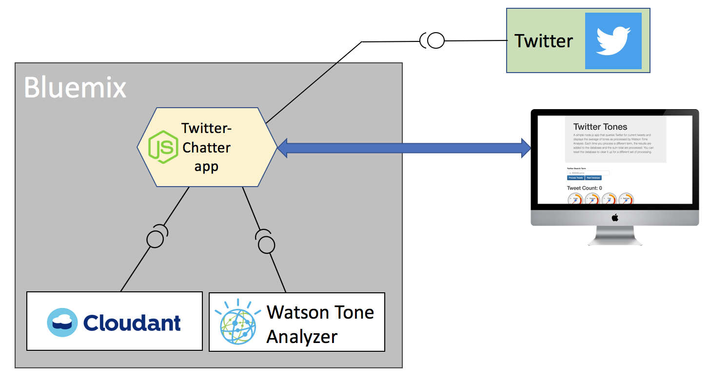

# Twitter Chatter 

This simple Node.js program for Bluemix leverages the [Twitter public REST APIs](https://dev.twitter.com/rest/public) and the IBM Watson Tone Analyzer to get the current sentiment about a term or group of terms.  This is not meant to be a production app, but rather a quickly created starting point for using Watson and Twitter services in a Bluemix app.

This reference app is provided under the [Apache 2 license](http://www.apache.org/licenses/LICENSE-2.0).

## Requirements

To run this application in Bluemix you will need your own Twitter credentials to use their API. Log into the 
[Twitter Apps console](https://apps.twitter.com/) and create a new app.  If you don't have an account at Twitter
you can sign up for a free developer account there, and then create your app keys.  These keys are passed into this 
app with environment variables, set from the Bluemix user interface.

This application will also create service instances for Watson Tone Analyzer and Cloudant NoSQL database, both 
using the free Lite plan.  Because of this the app may not scale beyond on developer user.  If you want to scale to production capacity you will need to use a database plan other than Lite.

## Architecture

This application leverages the Twitter public API, Watson Tone Analyzer to analyze the tweets and a cloudant database to store 
the tweets and analysis. A single page web app id presented to the user.

> Note: This app uses the Cloudant Database `Lite` plan.  This plan restricts the number of calls per second to 
> the database.  As a result, this application has a lot of code that serializes and delays database calls
> so as to not exceed these limits.  The resulting user experience is a very slow application.  If you 
> use a plan other than Lite, performance should be normal (very fast).

## Deployment Options

Use the Deploy to Bluemix Toolchain button below to quickly create your own instance of this 
application in your Github and Bluemix environment.  The [installation document](documentation/install.md) 
describes in detail how to install and setup this app in your Bluemix environment.

