# Install Twitter-Chatter

This document describes in detail how to clone this application into your Bluemix space and run it. 
You should have on hand your Twitter credentials.  If you don't have them now, go to 
[Twitter Apps console](https://apps.twitter.com/) and follow the instructions to create a new app 
and obtain the access and consumer tokens.  This application uses them in the form of a JSON object
so you should convert them into a JSON string like the following;

```javascript
{	
  "access_token": "XXXXXXXXXX-XXXXXXXXXXXXXXXXXXXXXXXXXXXXXXXXXXXXXXXX",	
  "access_token_secret": "XXXXXXXXXXXXXXXXXXXXXXXXXXXXXXXXXXXXXXXXXXXX",	
  "consumer_key": "XXXXXXXXXXXXXXXXXXXXXXx",	
  "consumer_secret": "XXXXXXXXXXXXXXXXXXXXXXXXXXXXXXXXXXXXXXXXXXXXXXXX" 
}
```

## Create Toolchain

1. Click on the Create Toolchain.

[](https://console.ng.bluemix.net/devops/setup/deploy/?repository=https%3A%2F%2Fgithub.com%2Fjconallen%2Ftwitter-chatter)

2. This will navigate you to Bluemix.  If you haven't logged in yet, log into Bluemix with your
Bluemix ID. Once logged into Bluemix the configuration settings for the Delivery Pipeline 
is displayed.  Confirm the target app name (you may want to remove the randomly generated 
identifier), region, organization and space.  Then click on teh GitRepos icon to confirm 
these settings.

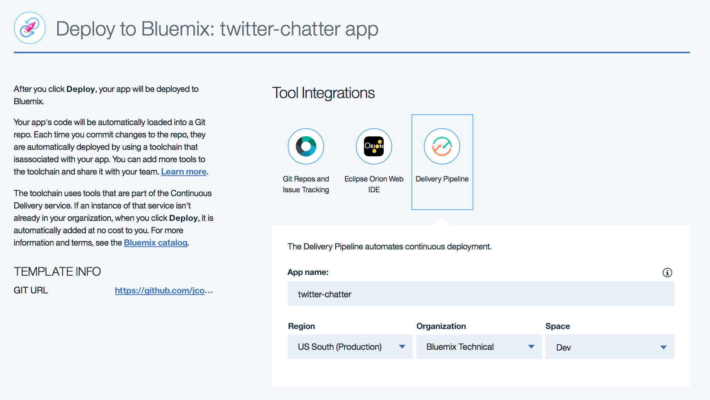

3. On the GitRepos settings, confirm the repository information (Clone to your repository), and 
optionally simplifying the new repository name.  When done. click on the Create button 
at the bottom of the page.

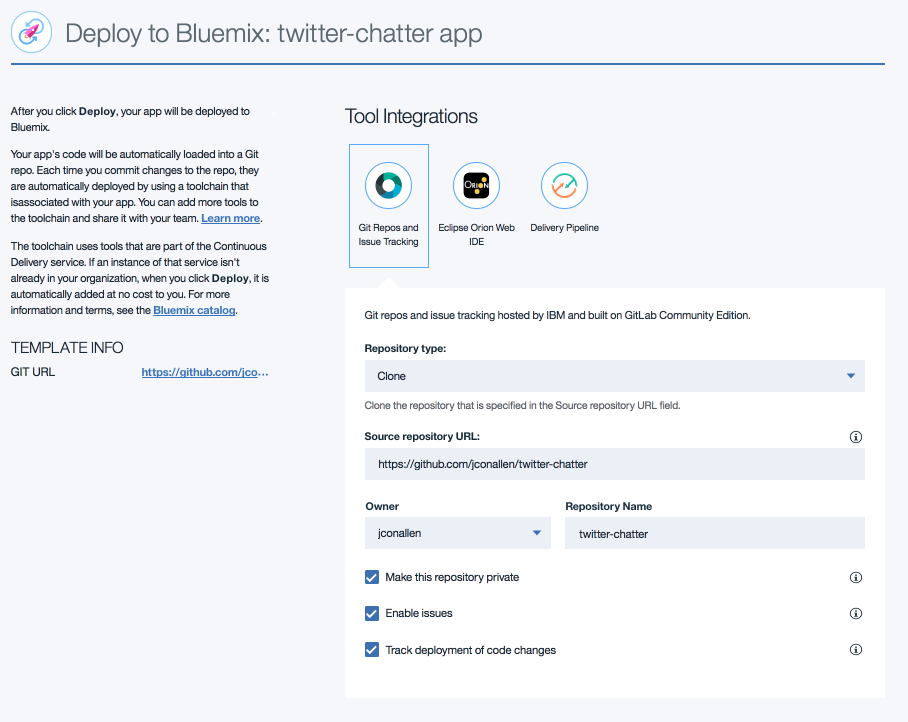

4. The toolchain is created in your space, and you are presented with the overview view.  Click on 
the Delivery Pipeline tool.

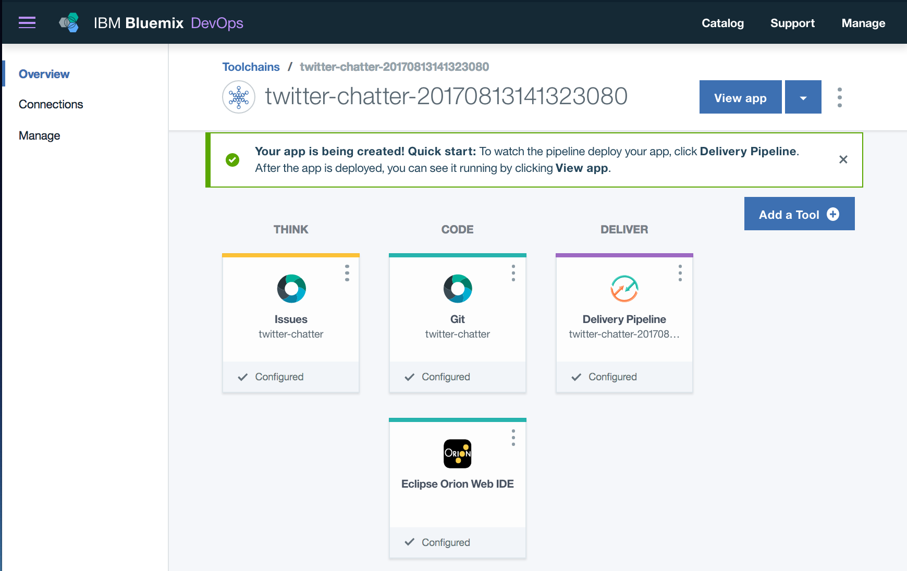

5. The build and deploy process will have automatically started.  The build should be fine, however the 
deployment will fail because we haven't configured the Twitter information yet.  

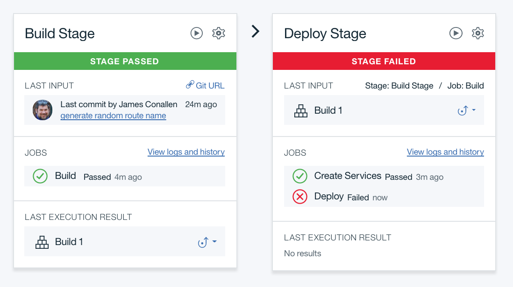

6. Use the hamburger menu (the menu icon with three horizontal lines) at the upper left of the screen and select Apps > Dashboard.

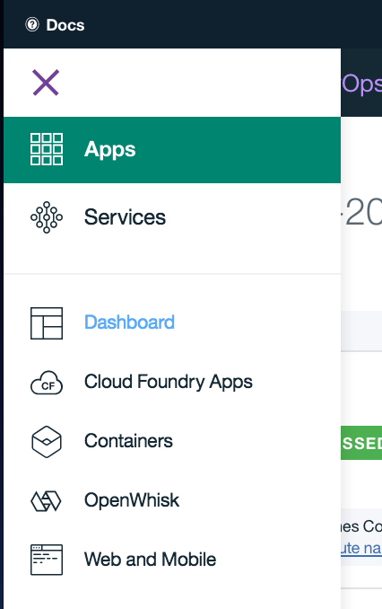

7. The apps in your space are displayed. If everything went OK, you should see three services at the bottom;
continuous delivery, a Cloudant database and Watson Tone Analyzer.  The app is listed at the top, and will 
not be running. Click on the app name to open up its dashboard.  Don't click on the link under the Route, that 
will just try to open up the app's home page (which isn't running yet).

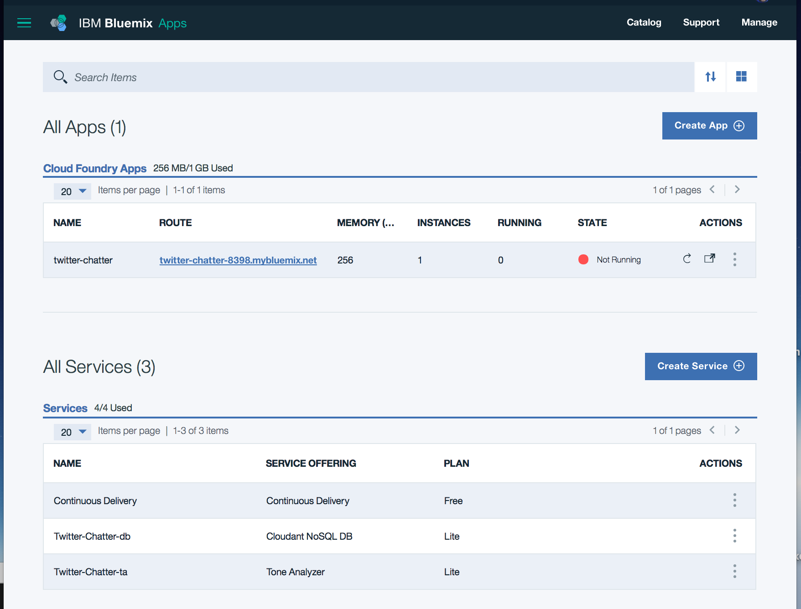

8. Select the Runtime tab on the left to display the runtime configuration page.  Then select the Environment 
variables tab in the middle of the page.

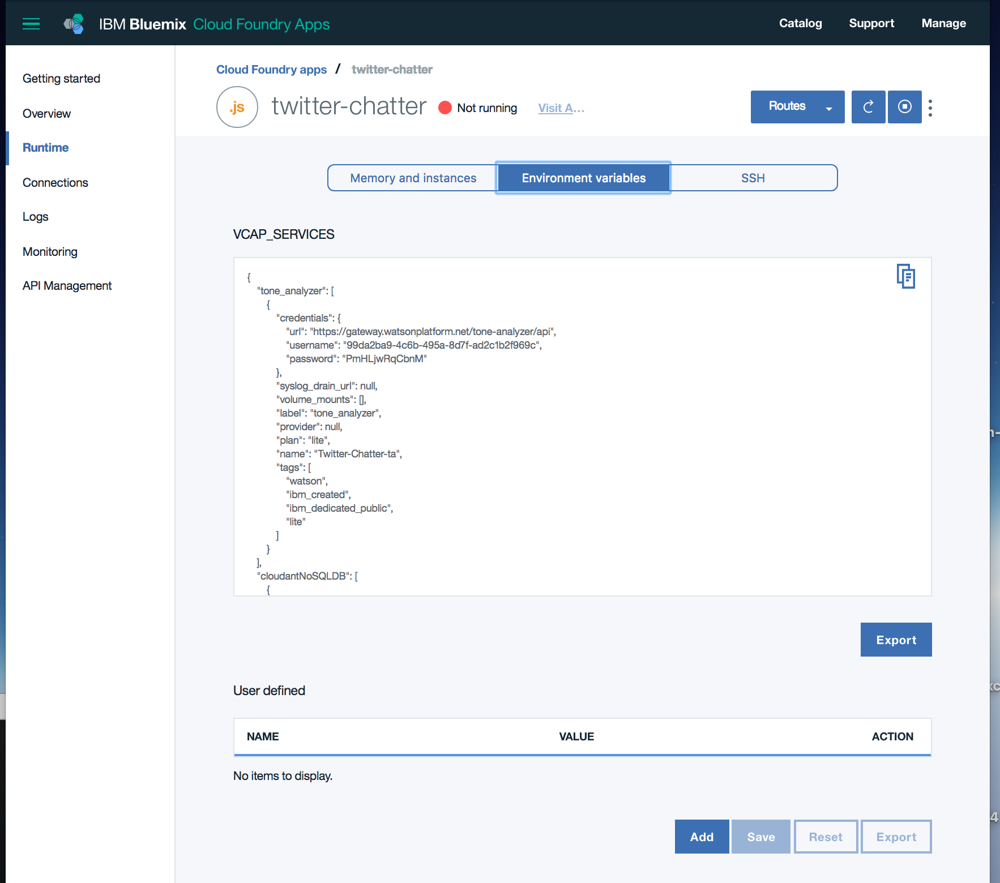

9. At the bottom of the page are the user defined environment variables. Click on the add button.  The name of the 
environment variable is `twitter_api` and the value is the JSON object you prepared earlier as a single line (remove 
all line breaks).  Press Save.

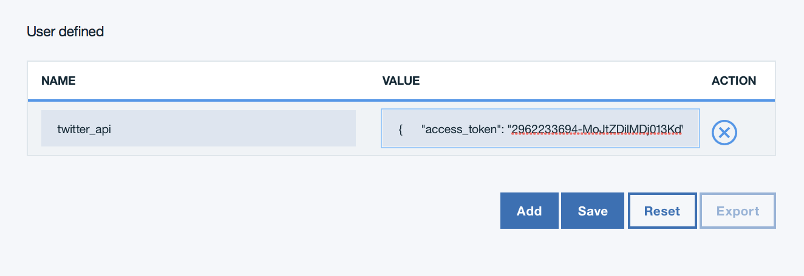

10. Changing the environment variables forces a restart of the application.  

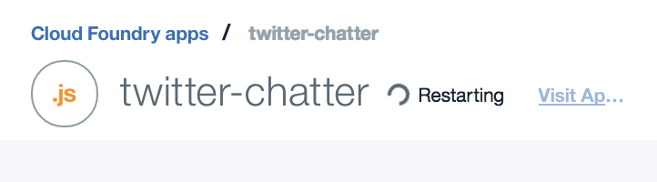

11. Once the app restarts (and you get a green running icon), click on the Visit App link to open up the app's home page.

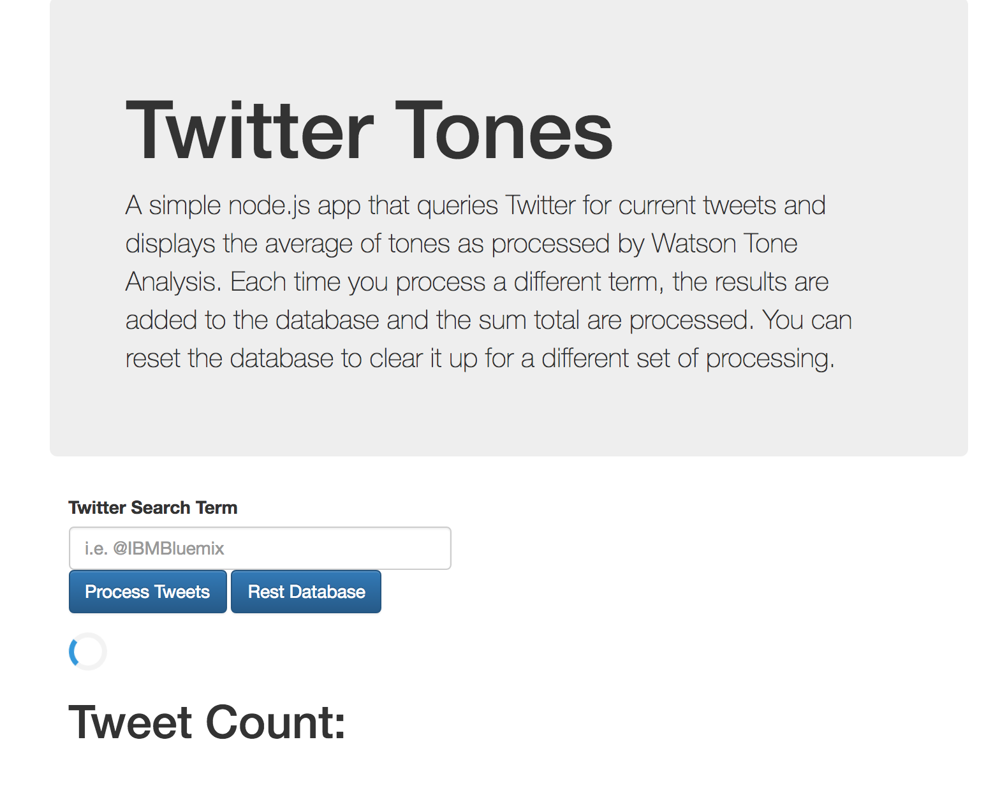

12. The app needs to initialize the database which will take a few seconds.  

> Note: This app uses the Lite Cloudant Database plan.  This plan restricts the number of calls per second to 
> the database.  As a result, this application has a lot of code that serializes and delays database calls
> so as to not exceed these limits.  The resulting user experience is a very slow application.  If you 
> use a plan other than Lite, performance should be normal (very fast).

13. When the app has initialized the display will include four [guages from Google](https://developers.google.com/chart/interactive/docs/gallery/gauge)
all initialized to zero with the number of tweets set to zero. To process some tweets enter in a search term
and press the Process Tweets button.

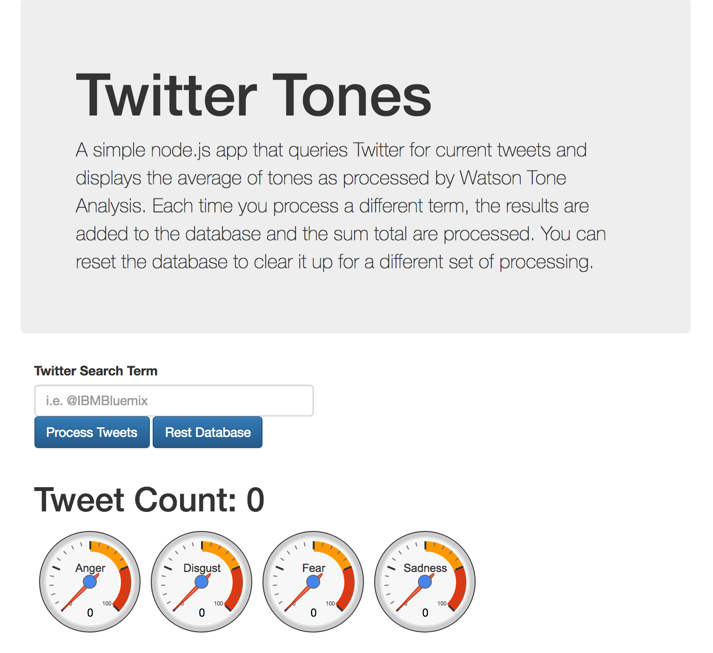

14. Remember this version of the app is serializing and delaying all database calls to prevent exceeding the Cloudant Lite plan
limits, so it will take a minute or so for the page to respond.  When it does the guages and number of tweets 
will be updated.  

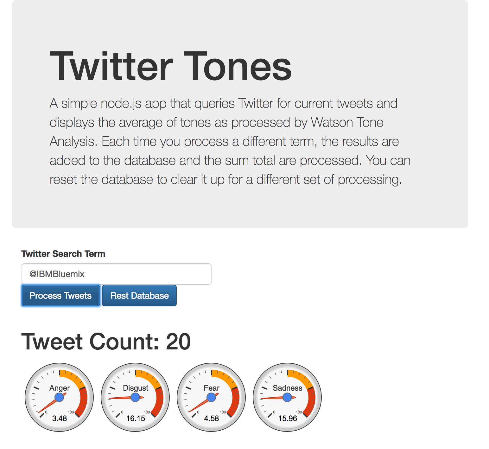

15. If you are interested in the details (and additional Watson analysis) all the data is stored in the Cloudant database.
Use the Bluemix UI to launch the Cloudant console and examine the data.